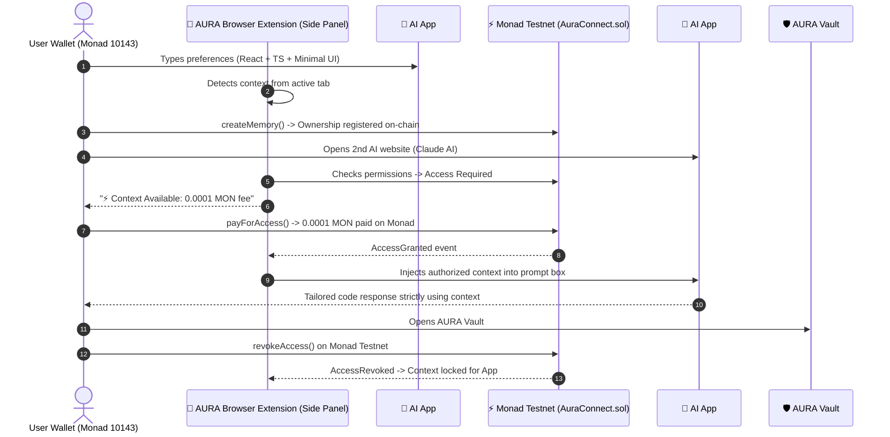

# AURA CONNECT 🧠⚡

> **"Your AI context layer that follows you across AI applications."**  
> A Sovereign Browser Extension & Protocol powered by the **Monad High-Throughput EVM**.

[](extension/)
[](https://monad.xyz)
[-836EF9.svg)](https://testnet.monadscan.com)
[](LICENSE)

---

### Your AI identity. Your memory. Your control.

Aura Connect is a **user-owned AI identity and context layer** that allows your AI memory, preferences, and context to travel with you across different applications.

Instead of teaching every AI application who you are from scratch, Aura Connect gives you a persistent AI identity anchored to your wallet that you control.

Your memories stay private and encrypted off-chain. Applications can request access to specific pieces of your context, and **you decide what they can access, approve or deny requests, and revoke access whenever you want on-chain.**

> **"Your AI shouldn't belong to the apps you use. It should belong to you."**

---

## 🌐 The Problem & The Breakthrough

Today, every AI assistant operates in a closed data silo:
1. **Context Fragmentation**: You repeat your tech stack, preferences, and projects to every new AI tool (ChatGPT, Claude, Cursor, v0, etc.).
2. **Zero Ownership**: Centralized AI platforms keep your context locked in their proprietary servers.
3. **No Portability or Sovereign Control**: You cannot permission, meter, or revoke AI access to your personal context across the web.

```text
             YOU
              │
      ┌───────┼────────┐
      ▼       ▼        ▼
   Chat AI  Code AI  Research AI
      │       │        │
   Memory  Memory   Memory
      │       │        │
      └───────┼────────┘
              │
          Fragmented & Siloed
```

---

## 💡 Solution: AURA CONNECT Extension & Protocol

**AURA CONNECT** is a **Chromium Browser Extension (Manifest V3 Side Panel)** and sovereign protocol that anchors your AI memory directly to your **Monad Wallet**:

- 🌐 **Context Capture (App #1)**: Captures your engineering preferences and habits from conversations, registering ownership on Monad via `createMemory()`.
- ⚡ **Cross-App Context Unlock (App #2)**: When visiting Claude, ChatGPT, or developer tools, AURA detects available context and unlocks it via a `0.0001 MON` micro-payment (`payForAccess()`).
- 🚀 **1-Click Prompt Injection**: Decrypts and injects authorized context directly into the AI's prompt box on any active tab.
- 🛡️ **AURA Vault**: Sovereign dashboard inside the extension side panel and web portal to revoke permissions on-chain (`revokeAccess()`) at any time.

```text
                         👤 YOU
                            │
                       🔐 YOUR WALLET
                            │
                            ▼
                 ┌────────────────────┐
                 │    AURA CONNECT    │
                 │                    │
                 │ 🪪 AI Identity     │
                 │ 🧠 AI Memory       │
                 │ 🔐 Permissions     │
                 │ 💰 Settlement      │
                 └─────────┬──────────┘
                            │
              ┌─────────────┼─────────────┐
              ▼             ▼             ▼
           Life AI       Code AI      Research AI
              │             │             │
              └─────────────┼─────────────┘
                            │
                      Your Context
```

---

## 🏗️ Architecture & Interaction Flow



---

## 🔐 Privacy & Security: Separation of Data and State

Aura Connect **never puts your private AI conversations in plaintext on the blockchain.**

| Layer | Component | Location | Details |
|---|---|---|---|
| **Off-chain** | Memory Content, Encrypted Embeddings, AI Responses | Encrypted Local/Decentralized Storage | Kept private; decrypted only in-memory when authorized |
| **On-chain** | Memory Hash (`bytes32`), Ownership, Permissions, Payments, Revocations | Monad EVM Contract (`AuraConnect.sol`) | High-speed, low-cost verifiable permission and settlement layer |

---

## 🌟 The North Star Demo Flow

1. **Install Extension**: Load unpacked extension from `extension/` in Chrome/Brave/Edge.
2. **Open Side Panel**: Click the AURA extension icon or extension menu to open the Side Panel.
3. **App 1 (Context Creation)**: Discuss your stack (*"I'm building with React and TypeScript and prefer minimal interfaces"*).
4. **Save to AURA**: Click **[ Save Context to Monad ]** → Real `createMemory()` on Monad Testnet.
5. **App 2 (Context Discovery)**: Navigate to Claude AI, ChatGPT, or open the Test Lab in the extension.
6. **Pay & Unlock**: Click **[ Unlock Context (0.0001 MON) ]** → Real `payForAccess()` on Monad.
7. **Inject Context**: Click **[ 🚀 Inject Context into AI Chat ]** → Automatically populates the active chat input!
8. **AURA Vault**: Inspect connected apps and click **[ Revoke Access ]** → Real `revokeAccess()` on Monad.
9. **Verify Denial**: Return to App #2 → Context is locked and access is denied.

---

## 📦 How to Load the Extension in Chrome

1. Open Chrome and navigate to `chrome://extensions`.
2. Enable **Developer mode** (toggle in the top-right corner).
3. Click **Load unpacked**.
4. Select the `extension` folder inside this repository:
   ```
   monad/extension/
   ```
5. Pin **AURA CONNECT** to your toolbar and click its icon to open the Side Panel!

---

## 📜 Smart Contract: `AuraConnect.sol`

- **Network**: Monad Testnet
- **Chain ID**: `10143` (`0x279f`)
- **RPC URL**: `https://testnet-rpc.monad.xyz`
- **Explorer**: `https://testnet.monadscan.com`
- **Deployed Contract Address**: `0x9A48F9c7A6E469bFe351E772877a5b3a8863f695`

### Key Contract Functions

| Function | Type | Description |
|---|---|---|
| `createMemory(bytes32 memoryId, string metadataURI, uint256 accessFee)` | State Modifying | Registers new context asset on Monad under caller's wallet |
| `payForAccess(bytes32 memoryId)` | Payable | Consumer pays access fee in MON to unlock memory; funds routed to owner |
| `grantAccess(bytes32 memoryId, address consumer)` | State Modifying | Memory owner grants direct permission |
| `revokeAccess(bytes32 memoryId, address consumer)` | State Modifying | Memory owner permanently revokes application permission |
| `hasAccess(bytes32 memoryId, address consumer)` | View | Verifies active permission status on-chain |
| `getUserMemories(address user)` | View | Returns array of memory IDs owned by address |

---

## 🚀 Running the Web Dashboard (AURA Vault Portal)

```bash
# 1. Install dependencies
npm install

# 2. Compile & Test Smart Contract
npm run compile:contract
npm run test:contract

# 3. Start Next.js Development Server
npm run dev
```
Open [http://localhost:3000](http://localhost:3000) to view the AURA Vault web portal.

---

## 🛠️ Tech Stack

- **Browser Extension**: Manifest V3, Side Panel API, Content Scripts, Service Worker, DOM Message Relay
- **Blockchain Layer**: Monad Testnet (Chain 10143), Solidity 0.8.28, Viem, Wagmi v2, RainbowKit
- **Full-Stack Portal**: Next.js 14 App Router, TypeScript, Tailwind CSS, Lucide Icons
- **Context Protocol**: Off-chain encrypted JSON storage mapped to cryptographic `bytes32` memory hashes

---

## 🏆 Built for Monad Blitz

Aura Connect is built demonstrating one complete vision:

> **A user can carry their AI identity from one application to another while retaining ownership and control.**

**Connect Wallet → Teach Life AI → Save Memory → Own It → Open Code AI → Request Context → Pay MON → Use Context → Revoke Access → Access Denied.**

---

## 📜 License

MIT License. See [LICENSE](LICENSE) for details.
