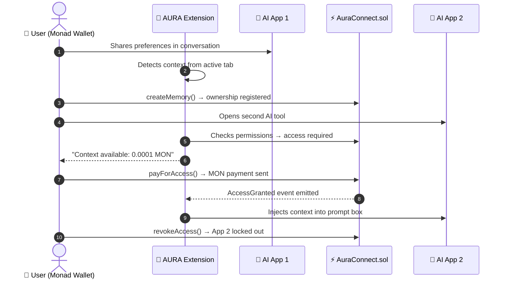

# AURA CONNECT 🧠⚡

> **Your AI context layer — portable, sovereign, and chain-anchored.**  
> A browser extension + protocol built on **Monad Testnet** that lets your AI memory travel with you across every AI application you use.

<div align="center">

[](extension/)
[](https://testnet.monadscan.com)
[](https://testnet.monadscan.com/address/0x9A48F9c7A6E469bFe351E772877a5b3a8863f695)
[](LICENSE)

</div>

---

## What is Aura Connect?

Every AI tool you use — ChatGPT, Claude, Cursor, Perplexity — starts from zero. You re-explain your stack, your preferences, your projects. Every time. Your context is trapped in silos you don't own.

**Aura Connect breaks that loop.** It gives you a sovereign AI identity anchored to your wallet. Your memories are encrypted off-chain. Ownership is registered on Monad. Access is permissioned by you, paid for in MON, and revocable at any time — on-chain.

```
Before Aura Connect         After Aura Connect

   YOU                           YOU
    │                             │
    ├── ChatGPT   (no context)    └── 🔐 YOUR WALLET
    ├── Claude    (no context)          │
    ├── Cursor    (no context)          └── AURA CONNECT
    └── ...       (no context)               │
                                    ┌────────┼────────┐
                                    ▼        ▼        ▼
                               ChatGPT   Claude   Cursor
                               (context) (context) (context)
```

---

## The Flow in 60 Seconds

1. **Teach App 1** — Have a conversation with any AI (e.g. ChatGPT). Express your preferences.
2. **Save to AURA** — Click *Save Context to Monad*. Calls `createMemory()` on-chain. You own it.
3. **Open App 2** — Navigate to Claude, Cursor, or any supported AI tool.
4. **Pay & Unlock** — AURA detects available context. Click *Unlock (0.0001 MON)*. Calls `payForAccess()`.
5. **Inject** — Click *🚀 Inject Context*. AURA populates the active AI's input box with your context.
6. **Revoke anytime** — Open the AURA Vault, click *Revoke*. Calls `revokeAccess()`. App 2 is locked out.

---

## Architecture



### Privacy Model

Your AI conversations **never go on-chain in plaintext**.

| Layer | What lives here | Where |
|---|---|---|
| **Off-chain** | Memory content, encrypted embeddings | Encrypted local / decentralized storage |
| **On-chain** | Memory hash (`bytes32`), ownership, permissions, payments | Monad EVM — `AuraConnect.sol` |

---

## Smart Contract

**Network:** Monad Testnet · **Chain ID:** `10143` · **RPC:** `https://testnet-rpc.monad.xyz`  
**Deployed at:** [`0x9A48F9c7A6E469bFe351E772877a5b3a8863f695`](https://testnet.monadscan.com/address/0x9A48F9c7A6E469bFe351E772877a5b3a8863f695)

| Function | Type | Purpose |
|---|---|---|
| `createMemory(bytes32, string, uint256)` | State | Registers memory asset on Monad under caller's wallet |
| `payForAccess(bytes32)` | Payable | Consumer pays MON fee; owner receives payment instantly |
| `grantAccess(bytes32, address)` | State | Owner grants free access to a consumer address |
| `revokeAccess(bytes32, address)` | State | Owner permanently locks a consumer out |
| `hasAccess(bytes32, address)` | View | Verifies active permission status |
| `getUserMemories(address)` | View | Returns all memory IDs owned by an address |

---

## Tech Stack

| Layer | Technologies |
|---|---|
| **Extension** | Chrome Manifest V3, Side Panel API, Content Scripts, Service Worker |
| **Blockchain** | Monad Testnet (10143), Solidity 0.8.28, Viem, Wagmi v2, RainbowKit |
| **Web Portal** | Next.js 14 App Router, TypeScript, Tailwind CSS, Lucide Icons |
| **Context Protocol** | Off-chain encrypted JSON → `bytes32` memory hash on Monad |

---

## Getting Started

### Prerequisites

- Node.js `v18+`
- Chrome / Brave / Edge (Manifest V3 support)
- MetaMask or any EVM wallet with Monad Testnet configured
- Monad Testnet MON (faucet: [faucet.monad.xyz](https://faucet.monad.xyz))

### 1. Clone & Install

```bash
git clone https://github.com/<your-username>/Aura-Connect.git
cd Aura-Connect
npm install
```

### 2. Configure Environment

```bash
cp .env.example .env.local
```

Edit `.env.local`:

```env
NEXT_PUBLIC_MONAD_RPC=https://testnet-rpc.monad.xyz
NEXT_PUBLIC_CHAIN_ID=10143
NEXT_PUBLIC_CONTRACT_ADDRESS=0x9A48F9c7A6E469bFe351E772877a5b3a8863f695
```

### 3. Load the Chrome Extension

```bash
# (Optional) Rebuild the extension web3 bundle
npm run build:extension
```

Then in Chrome:

1. Go to `chrome://extensions`
2. Enable **Developer mode** (toggle, top-right)
3. Click **Load unpacked**
4. Select the `extension/` folder in this repo
5. Pin **AURA CONNECT** to your toolbar — click its icon to open the Side Panel

### 4. Run the Web Portal (AURA Vault)

```bash
npm run dev
```

Open [http://localhost:3000](http://localhost:3000) to access the AURA Vault dashboard.

### 5. (Optional) Compile & Deploy Your Own Contract

```bash
npm run compile:contract
npm run deploy:contract
```

Update `NEXT_PUBLIC_CONTRACT_ADDRESS` in `.env.local` with your new deployment address.

---

## Project Structure

```
Aura-Connect/
├── contracts/
│   └── AuraConnect.sol          # Sovereign memory & permission contract
├── extension/
│   ├── manifest.json            # Chrome MV3 manifest
│   ├── background.js            # Service worker — tab detection
│   ├── content.js               # DOM injection — populates AI chat inputs
│   ├── src/
│   │   └── web3-client.ts       # Viem client for Monad interactions
│   └── sidepanel/
│       ├── sidepanel.html       # Extension side panel UI
│       ├── sidepanel.js         # Full UI state & Web3 integration
│       └── sidepanel.css        # Styling
├── src/
│   ├── app/                     # Next.js App Router pages
│   ├── components/              # React UI components
│   ├── config/                  # Wagmi / RainbowKit config
│   ├── contracts/               # ABI and contract bindings
│   └── services/                # Business logic and API services
├── scripts/
│   ├── compile.ts               # Solidity compiler script
│   ├── deploy.ts                # Contract deployment script
│   └── build-extension-web3.js  # Extension bundle builder
├── .env.example                 # Environment variable template
└── package.json
```

---

## Supported AI Platforms

Out of the box, AURA injects context into:

- **Claude** (`claude.ai`)
- **ChatGPT** (`chatgpt.com`, `chat.openai.com`)
- **Perplexity** (`perplexity.ai`)
- **Localhost** (for development / test rigs)

To add a new platform, add its domain to `content_scripts.matches` in `extension/manifest.json` and ensure its chat input selector is handled in `content.js`.

---

## Roadmap

- [ ] **Encryption layer** — AES-GCM local encryption before context is stored
- [ ] **IPFS / decentralized storage** — Replace local storage with pinned IPFS or Arweave for true decentralization
- [ ] **Memory categories** — Separate slots for Code Preferences, Writing Style, Research Context
- [ ] **Multi-memory paywall** — Bundle multiple memory IDs in a single `payForAccess` call
- [ ] **Firefox / Safari port** — Extend the extension to other browsers
- [ ] **Shared / public memories** — Opt-in discovery for context templates others can purchase
- [ ] **Memory expiry** — Time-limited access tokens with on-chain TTL
- [ ] **Mainnet deployment** — When Monad launches mainnet

---

## Contributing

Pull requests are welcome. For significant changes, please open an issue first to discuss what you'd like to change.

```bash
# Run linter
npm run lint

# Test contract interactions
npm run test:contract
```

---

## License

[MIT](LICENSE) — built with ❤️ for [Monad Blitz](https://monad.xyz).
