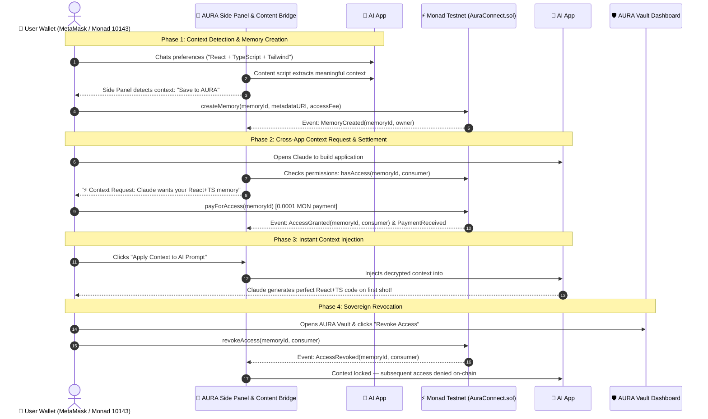

<div align="center">

# 🧠⚡ AURA CONNECT

### *Your AI Memory. Your Control. Across Every App.*

A sovereign AI context protocol and Chromium browser extension powered by the **Monad High-Throughput EVM**.

[](https://monad.xyz)
[-836EF9?style=for-the-badge&logo=ethereum&logoColor=white)](https://testnet.monadscan.com/address/0x9A48F9c7A6E469bFe351E772877a5b3a8863f695)
[](extension/)
[](contracts/AuraConnect.sol)
[](src/)
[](LICENSE)

<br/>

[**Live Contract (MonadScan)**](https://testnet.monadscan.com/address/0x9A48F9c7A6E469bFe351E772877a5b3a8863f695) • [**Extension Architecture**](#-how-it-works--3-steps) • [**Judge Demo Script**](#-3-minute-demo-script-judges-walkthrough) • [**Smart Contract**](#-smart-contract-auraconnectsol) • [**Quick Start**](#-quick-start)

</div>

---

## 🚨 The Problem

1. **Every AI is a data silo** — Your preferences, tech stack, and background are trapped inside individual platforms.
2. **You repeat yourself constantly** — Re-explaining who you are, how you code, and what you need on every new chat.
3. **You own nothing** — Centralized AI vendors own your interaction history, with zero portability and zero user consent.

---

## 💡 The Solution

**AURA CONNECT** gives you a **portable AI identity anchored directly to your Monad wallet**. 

Your AI memory follows you everywhere you browse. When you switch between ChatGPT, Claude, Perplexity, or developer tools, AURA securely carries your context along with you. You retain sovereign control: AI apps must request permission and settle micro-fees via Monad smart contracts before accessing your context, and you can revoke access anytime with a single click.

> **"Your AI shouldn't belong to the apps you use. It should belong to you."**

---

## ⚡ How It Works — 3 Steps

```
   ┌──────────────┐         ┌──────────────┐         ┌──────────────┐
   │   1. SAVE    │   ───►  │  2. CONTROL  │   ───►  │   3. CARRY   │
   │  Detect &    │         │  On-Chain    │         │  Inject into │
   │  Register    │         │ Permissions  │         │  Any AI Chat │
   └──────────────┘         └──────────────┘         └──────────────┘
```

| Step | Action | Description |
|---|---|---|
| **1. 🧠 SAVE** | **Detect & Anchor** | As you chat with AI assistants (e.g., ChatGPT), AURA detects vital preferences (coding stack, guidelines, project requirements). With one click, your context is encrypted off-chain and registered on-chain via `createMemory()` on Monad. |
| **2. 🔐 CONTROL** | **Permission & Monetize** | When another AI application (e.g., Claude) requests your context, you review the permission request. Apps unlock access by settling a `0.0001 MON` micro-fee via `payForAccess()`. You can revoke access at any time directly from your AURA Vault. |
| **3. ⚡ CARRY** | **Decrypt & Inject** | Once authenticated by the smart contract, AURA automatically decrypts and injects your structured context directly into the target AI’s prompt input box, delivering seamless personalized responses across the entire web. |

---

## 🏗️ Architecture Diagram



---

## 📜 Smart Contract: `AuraConnect.sol`

A lightweight, gas-optimized Solidity protocol running natively on **Monad Testnet**. It acts as the global registry of memory ownership, access permissions, and micro-payment settlement.

- **Network**: Monad Testnet (EVM)
- **Chain ID**: `10143` (`0x279f`)
- **RPC URL**: `https://testnet-rpc.monad.xyz`
- **Explorer**: `https://testnet.monadscan.com`
- **Deployed Contract Address**: [`0x9A48F9c7A6E469bFe351E772877a5b3a8863f695`](https://testnet.monadscan.com/address/0x9A48F9c7A6E469bFe351E772877a5b3a8863f695)

### Contract Interface & Function Reference

| Function | Type | Parameters | Description |
|---|---|---|---|
| `createMemory` | Write | `bytes32 memoryId, string metadataURI, uint256 accessFee` | Registers a new cryptographic context record on Monad owned by `msg.sender`. |
| `payForAccess` | Payable | `bytes32 memoryId` | Consumer/App pays the required MON fee (e.g. `0.0001 MON`) to unlock memory; funds route directly to the memory owner. |
| `grantAccess` | Write | `bytes32 memoryId, address consumer` | Memory owner explicitly grants access permission to a specified address/agent. |
| `revokeAccess` | Write | `bytes32 memoryId, address consumer` | Memory owner permanently revokes access permission on-chain. |
| `hasAccess` | View | `bytes32 memoryId, address consumer` | Returns `true` if `consumer` has active authorized access (or is the memory owner). |
| `getMemory` | View | `bytes32 memoryId` | Returns the `MemoryRecord` tuple (owner, URI, fee, timestamp, status). |
| `getUserMemories` | View | `address user` | Returns an array of all `bytes32` memory IDs registered by a wallet address. |
| `totalMemoriesCount`| View | *none* | Returns the total count of registered context assets globally. |

---

## 🔐 Privacy & Security: Separation of Data and State

AURA CONNECT follows a zero-compromise architectural principle: **Raw private conversations are NEVER stored on the public blockchain.**

```
┌────────────────────────────────────────┐       ┌────────────────────────────────────────┐
│          OFF-CHAIN PRIVACY             │       │          ON-CHAIN VERIFICATION         │
├────────────────────────────────────────┤       ├────────────────────────────────────────┤
│ • Raw Conversation Transcripts         │       │ • bytes32 Cryptographic Memory Hash    │
│ • Local Encrypted Context Storage      │  ───► │ • Wallet Ownership Registry            │
│ • Client-Side Decryption Keys          │       │ • Granular Access Permissions Boolean  │
│ • In-Memory DOM Prompt Injection       │       │ • 0.0001 MON Micro-Payment Settlement  │
└────────────────────────────────────────┘       └────────────────────────────────────────┘
```

| Layer | Component | Storage / Execution Location | Security Model |
|---|---|---|---|
| **Off-Chain** | Raw context, technical stack preferences, conversation snippets | Encrypted Browser Storage / Encrypted Decentralized Store | Zero plain text exposure. Only decrypted in client memory upon verified contract authorization. |
| **On-Chain** | Memory Identifier (`bytes32`), Access List, Fee Escrow, Revocation State | Monad EVM Smart Contract (`AuraConnect.sol`) | Cryptographically enforced ownership, immutable access logs, and verifiable permission gating. |

---

## ⏱️ 3-Minute Demo Script (Judge's Walkthrough)

Follow this exact step-by-step script to test the complete end-to-end user journey:

```
Step 1: Install Extension  ──►  Step 2: Connect MetaMask  ──►  Step 3: Chat in ChatGPT
            │                                                         │
            ▼                                                         ▼
Step 6: Unlock on Claude   ◄──  Step 5: Switch to Claude  ◄──  Step 4: Save to AURA
            │
            ▼
Step 7: Inject Context     ──►  Step 8: Revoke in Vault   ──►  Step 9: Verify Revoked
```

### **Step 1: Load Extension in Chrome**
1. Open Google Chrome and go to `chrome://extensions`.
2. Toggle on **Developer mode** (top right corner).
3. Click **Load unpacked** and select the `monad/extension` directory.
4. Pin **AURA CONNECT** to your Chrome toolbar.

### **Step 2: Open Side Panel & Connect MetaMask**
1. Click the AURA icon in your toolbar to open the **Side Panel**.
2. Connect your MetaMask wallet (switches automatically to **Monad Testnet**, Chain ID `10143`).
3. View your connected wallet address in the AURA header.

### **Step 3: Teach Context in ChatGPT**
1. Navigate to [chatgpt.com](https://chatgpt.com).
2. Enter your preferences in chat, for example:
   > *"I build with React and TypeScript and prefer minimal dark interfaces."*

### **Step 4: Save to AURA (On-Chain Transaction)**
1. Look at the AURA Side Panel — it automatically detects your key preferences!
2. Click **[ Save to AURA ]**.
3. Confirm the transaction in MetaMask to execute `createMemory()` on Monad Testnet.
4. Note the confirmed transaction hash on MonadScan.

### **Step 5: Switch to Claude**
1. Open a new tab and navigate to [claude.ai](https://claude.ai).
2. AURA Side Panel instantly detects the active tab switch to Claude.

### **Step 6: Request Context & Pay 0.0001 MON**
1. The Side Panel presents a **Context Request**: *"Claude wants to use your React + TypeScript context"*.
2. Click **[ Allow & Unlock (0.0001 MON) ]**.
3. Confirm the `payForAccess()` transaction in MetaMask.
4. Monad settles the micro-fee in milliseconds, granting instant access.

### **Step 7: Apply Context (Prompt Injection)**
1. The Side Panel updates to **✓ CONTEXT SHARED**.
2. Click **[ 🚀 Apply Context to AI Prompt ]**.
3. Watch the authorized context instantly populate Claude’s prompt textarea!

### **Step 8: Open AURA Vault & Revoke Access**
1. Switch to the **Vault** tab in the AURA Side Panel (or open the Web Portal at `localhost:3000`).
2. Locate **Claude** under *Who Can Access Your Context?*.
3. Click **[ Revoke Access ]** and confirm the `revokeAccess()` transaction on Monad.

### **Step 9: Verify Revocation**
1. Return to the Home tab while on Claude.
2. The UI immediately displays **🔒 ACCESS REVOKED — Context access is blocked**.
3. The smart contract on Monad now returns `hasAccess(...) == false`, proving immutable access denial.

---

## ⚡ Why Monad?

AURA CONNECT relies on high-frequency, granular user interactions that are impractical on legacy blockchains:

* ⚡ **10,000 TPS & Sub-Second Finality**: When switching between browser tabs and AI tools, users cannot wait 15 seconds for a block confirmation. Monad delivers instant authorization and prompt injection.
* 💰 **Negligible Micro-Gas Fees**: Enabling `0.0001 MON` micro-payments per context unlock requires transaction fees that cost a fraction of a cent.
* 🛠️ **Full EVM Compatibility**: Standard Solidity contracts, seamless Viem/Wagmi integration, and out-of-the-box MetaMask support without custom wallet wrappers.

---

## 🛠️ Tech Stack

<div align="center">

| Area | Technologies |
|---|---|
| **Browser Extension** | Chrome Manifest V3, Side Panel API, Content Scripts, DOM Scraping & In-Page Web3 Bridge |
| **Blockchain & Protocol** | Monad Testnet (Chain ID `10143`), Solidity `0.8.20`, Viem `^2.21`, Wagmi `^2.12`, RainbowKit |
| **Web Dashboard** | Next.js 14 (App Router), React 18, TypeScript, Tailwind CSS, Lucide Icons |
| **Context Protocol** | Off-chain encrypted JSON payload mapped to cryptographic `bytes32` memory hashes |

</div>

---

## 🚀 Quick Start

### Prerequisites
- Node.js 18+ & npm
- Google Chrome or Chromium-based browser (Brave, Edge)
- MetaMask wallet funded with free Monad Testnet tokens ([Monad Faucet](https://testnet.monad.xyz/))

### 1. Clone & Install Dependencies
```bash
git clone https://github.com/kumarswamynaidu09/Aura-Connect.git
cd Aura-Connect

# Install dependencies
npm install
```

### 2. Compile & Test Smart Contract
```bash
# Compile Solidity contracts
npm run compile:contract

# Run contract test suite
npm run test:contract
```

### 3. Run Web Dashboard
```bash
# Start Next.js development server
npm run dev
```
Open [http://localhost:3000](http://localhost:3000) in your browser.

### 4. Load Chrome Extension
1. Go to `chrome://extensions` in Chrome.
2. Enable **Developer mode** (top right).
3. Click **Load unpacked** and select the `extension/` folder in this repository.
4. Pin the extension and start exploring!

---

## 👥 Team & Hackathon Submission

Built with 💜 for the **Monad Blitz Hackathon 2026**.

- **Project**: AURA CONNECT
- **Theme**: Sovereign AI Context & User-Owned Memory Layer
- **Contract**: [`0x9A48F9c7A6E469bFe351E772877a5b3a8863f695`](https://testnet.monadscan.com/address/0x9A48F9c7A6E469bFe351E772877a5b3a8863f695)

---

## 📜 License

This project is open-source software licensed under the [MIT License](LICENSE).
